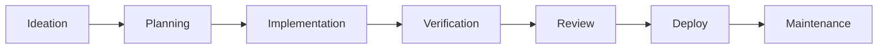

# Skills

A curated Agent Skills catalog for practicing the **AIgile SDLC**: a spec-first, test-first, verification-driven workflow for AI-assisted software delivery.

## Quick Start

List available skills:

```bash
npx skills add jae-labs/skills --list
```

Install all skills:

```bash
npx skills add jae-labs/skills --skill '*'
```

Install one skill:

```bash
npx skills add jae-labs/skills --skill security-and-hardening
```

## Goal And Purpose

This catalog curates and integrates tools and practices for AI-assisted software delivery. Instead of reinventing standard workflows, it references and adapts community skills.

Because agent tools and skill formats evolve quickly, this catalog remains a living integration layer.

AIgile SDLC combines:

- Agile and XP feedback loops.
- Spec-driven development for AI coding agents.
- TDD and systematic debugging.
- Context engineering for agent output quality.
- Source-driven development against official documentation.
- Doubt-driven review of non-trivial decisions.
- Architecture records and review gates.
- Structural code quality review.
- Agent Skills for dynamic, low-token procedural context.
- Verification before completion.
- CI/CD automation and staged rollouts.
- Observability and deprecation discipline.
- Ongoing maintenance: simplification, hardening, optimization, architecture deepening.



## AIgile SDLC Workflow

```mermaid
flowchart TD
    Start["Idea or request"] --> A["1. global-rules"]
    A --> B["2. context-engineering"]
    B --> C["3. brainstorming"]
    C --> D{"Need deeper<br>challenge?"}
    D -->|yes| E["4. grill-me"]
    D -->|no| F["Spec or issue"]
    E --> F
    F --> G["5. triage"]
    G --> H{"Architecture<br>decision?"}
    H -->|yes| I["ADR / notes"]
    H -->|no| J["6. writing-plans"]
    I --> J
    J --> K["7. using-git-worktrees"]
    K --> L["8. executing-plans"]
    L --> L2{"Non-trivial<br>decision?"}
    L2 -->|yes| L3["11. doubt-driven-development"]
    L2 -->|no| L4{"Framework<br>code?"}
    L3 --> L4
    L4 -->|yes| L5["10. source-driven-development"]
    L4 -->|no| L6{"UI or API?"}
    L5 --> L6
    L6 -->|UI| L7["12. frontend-ui-engineering"]
    L6 -->|API| L8["13. api-and-interface-design"]
    L7 --> M["9. test-driven-development"]
    L8 --> M
    M --> N{"Failure?"}
    N -->|yes| O["14. systematic-debugging"]
    O --> M
    N -->|no| N2{"Browser-facing?"}
    N2 -->|yes| P1["16. browser-testing-with-devtools"]
    N2 -->|no| P["15. verification-before-completion"]
    P1 --> P
    P --> Q["17. thermo-nuclear-code-quality-review"]
    Q --> R["18. requesting-code-review"]
    R --> S["19. receiving-code-review"]
    S --> T["20. md-docs"]
    T --> U["21. create-pr"]
    U --> V["22. finishing-a-development-branch"]
    V --> W["Review, merge, measure"]
    W --> W2{"Deploying?"}
    W2 -->|yes| W3["Deploy skills<br>23-26"]
    W2 -->|no| MT{"Maintenance<br>needed?"}
    W3 --> MT
    MT -->|yes| X["Maintenance skills<br>27-30"]
    MT -->|no| Done["Done"]
```



## Folder Structure

All installable skills live in one flat namespace:

| Folder | Contents |
| --- | --- |
| `skills/<skill-name>/` | One directory per installable skill. Each directory contains a `SKILL.md` and any supporting files for that skill. |

The `Authors` column shows upstream sources in `owner/repo:skillname` format. Local copies can differ significantly — some skills were rewritten or merged for this repo. Some are wired to route into or hand off to other skills. The flat layout keeps every skill addressable by name.

## Skill Catalog

### AIgile SDLC Core

`#` follows the main workflow above.

| Category | # | Skill | Purpose | Authors |
| --- | --- | --- | --- | --- |
| Foundation | 1 | `global-rules` | Global engineering posture, concise communication, documentation lookup rules, and mandatory skill discovery. Install first. | [Local](skills/global-rules/SKILL.md) |
| Foundation | 2 | `context-engineering` | Feed agents the right information at the right time. Use at session start, when switching from design to implementation, or when output quality degrades. | [addyosmani/agent-skills:context-engineering](skills/context-engineering/SKILL.md) |
| Ideation | 3 | `brainstorming` | Extract intent, ask one question at a time with guesses, generate forced variation approaches, surface assumptions, produce a full spec (objective, architecture, commands, code style, boundaries, success criteria, out of scope), self-review, and get user approval before implementation. | [obra/superpowers:brainstorming](skills/brainstorming/SKILL.md) |
| Ideation | 4 | `grill-me` | Stress-test a design or plan through relentless one-question-at-a-time interrogation with confidence scoring, decision tree resolution, codebase grounding, and anti-rationalization checks until every branch has a concrete resolution. | [mattpocock/skills:grill-me](skills/grill-me/SKILL.md) |
| Ideation | 5 | `triage` | Convert issues into durable agent-ready briefs with acceptance criteria and scope boundaries. | [mattpocock/skills:triage](skills/triage/SKILL.md) |
| Planning | 6 | `writing-plans` | Convert approved specs into executable plans with dependency graphs, vertical slicing, route/surface mapping, bite-sized TDD steps, task sizing, checkpoints, and risk documentation. Mandatory before multi-step implementation. | [obra/superpowers:writing-plans](skills/writing-plans/SKILL.md), [addyosmani/agent-skills:planning-and-task-breakdown](skills/writing-plans/SKILL.md) |
| Planning | 7 | `using-git-worktrees` | Set up or verify isolated workspaces before implementation. | [obra/superpowers:using-git-worktrees](skills/using-git-worktrees/SKILL.md) |
| Implementation | 8 | `executing-plans` | Execute a written implementation plan task by task with incremental delivery, traceability back to the approved request, review checkpoints, scope discipline, git discipline, and simplicity-first rules. | [obra/superpowers:executing-plans](skills/executing-plans/SKILL.md), [addyosmani/agent-skills:incremental-implementation](skills/executing-plans/SKILL.md), [addyosmani/agent-skills:git-workflow-and-versioning](skills/executing-plans/SKILL.md) |
| Implementation | 9 | `test-driven-development` | Enforce red-green-refactor for features, bug fixes, behavior changes, and refactors. | [obra/superpowers:test-driven-development](skills/test-driven-development/SKILL.md) |
| Implementation | 10 | `source-driven-development` | Ground every framework decision in official documentation. Verify, cite sources, and flag what's unverified. | [addyosmani/agent-skills:source-driven-development](skills/source-driven-development/SKILL.md) |
| Implementation | 11 | `doubt-driven-development` | Subject non-trivial decisions to adversarial fresh-context review. CLAIM → EXTRACT → DOUBT → RECONCILE → STOP. | [addyosmani/agent-skills:doubt-driven-development](skills/doubt-driven-development/SKILL.md) |
| Implementation | 12 | `frontend-ui-engineering` | Build production-quality UIs with accessibility, design system adherence, responsive design, no AI aesthetic, and no fake preview surfaces standing in for requested product behavior. | [addyosmani/agent-skills:frontend-ui-engineering](skills/frontend-ui-engineering/SKILL.md) |
| Implementation | 13 | `api-and-interface-design` | Design stable, well-documented APIs and interfaces that are hard to misuse. Contract-first, Hyrum's Law, consistent errors. | [addyosmani/agent-skills:api-and-interface-design](skills/api-and-interface-design/SKILL.md) |
| Verification | 14 | `systematic-debugging` | Investigate root cause before fixes. Stop-the-line rule, error-specific triage, git bisect, safe fallbacks, untrusted data treatment. | [obra/superpowers:systematic-debugging](skills/systematic-debugging/SKILL.md), [addyosmani/agent-skills:debugging-and-error-recovery](skills/systematic-debugging/SKILL.md) |
| Verification | 15 | `verification-before-completion` | Require fresh evidence before claiming work is complete, fixed, or passing. | [obra/superpowers:verification-before-completion](skills/verification-before-completion/SKILL.md) |
| Verification | 16 | `browser-testing-with-devtools` | Test and debug in real browsers via Chrome DevTools MCP. Mandatory for browser-facing work before completion claims. Inspect DOM, capture console errors, analyze network requests, profile performance, verify accessibility. | [addyosmani/agent-skills:browser-testing-with-devtools](skills/browser-testing-with-devtools/SKILL.md) |
| Review | 17 | `thermo-nuclear-code-quality-review` | Run an extremely strict maintainability review focused on structural quality, code judo, file size, and abstraction health. | [cursor/plugins:thermo-nuclear-code-quality-review](skills/thermo-nuclear-code-quality-review/SKILL.md) |
| Review | 18 | `requesting-code-review` | Request an independent code review after implementation and verification. | [obra/superpowers:requesting-code-review](skills/requesting-code-review/SKILL.md) |
| Review | 19 | `receiving-code-review` | Address review feedback rigorously and track disposition of each finding. | [obra/superpowers:receiving-code-review](skills/receiving-code-review/SKILL.md) |
| Deploy | 20 | `md-docs` | Maintain `README.md`, `AGENTS.md`, and `CLAUDE.md` with a strict human-vs-agent audience split. Routes ADR writing for architectural decisions. | [PaulRBerg/agent-skills:md-docs](skills/md-docs/SKILL.md), [addyosmani/agent-skills:documentation-and-adrs](skills/md-docs/SKILL.md) |
| Deploy | 21 | `create-pr` | Inspect local changes and create high-quality PR descriptions through the GitHub CLI. | [Local](skills/create-pr/SKILL.md) |
| Deploy | 22 | `finishing-a-development-branch` | Decide how to integrate completed branch work after verification. | [obra/superpowers:finishing-a-development-branch](skills/finishing-a-development-branch/SKILL.md) |
| Deploy | 23 | `ci-cd-and-automation` | Automate quality gates so no change reaches production without passing tests, lint, type checking, and build. Shift left, faster is safer, pre-commit hygiene, GitHub Actions, deployment strategies, feature flags, staged rollouts, rollback plans. | [addyosmani/agent-skills:ci-cd-and-automation](skills/ci-cd-and-automation/SKILL.md) |
| Deploy | 24 | `deprecation-and-migration` | Remove code that no longer earns its keep and move users safely from old to new. Deprecation decision framework, compulsory vs advisory, strangler pattern, adapter pattern, feature flag migration, zombie code identification. | [addyosmani/agent-skills:deprecation-and-migration](skills/deprecation-and-migration/SKILL.md) |
| Deploy | 25 | `observability-and-instrumentation` | Instrument code so production behavior is visible and diagnosable. Structured logging, RED/USE metrics, OpenTelemetry tracing, symptom-based alerting, correlation IDs, cardinality discipline. | [addyosmani/agent-skills:observability-and-instrumentation](skills/observability-and-instrumentation/SKILL.md) |
| Deploy | 26 | `shipping-and-launch` | Ship with confidence. Pre-launch checklist (code quality, security, performance, accessibility, infrastructure, documentation), feature flag lifecycle, staged rollout, monitoring, rollback strategy, post-launch verification. | [addyosmani/agent-skills:shipping-and-launch](skills/shipping-and-launch/SKILL.md) |
| Maintenance | 27 | `code-simplification` | Simplify code for clarity without changing behavior. Chesterton's Fence, language-specific guidance, Rule of 500. | [addyosmani/agent-skills:code-simplification](skills/code-simplification/SKILL.md) |
| Maintenance | 28 | `security-and-hardening` | Harden code against vulnerabilities. OWASP Top 10, threat modeling, input validation, secrets management, SSRF prevention, LLM security. | [addyosmani/agent-skills:security-and-hardening](skills/security-and-hardening/SKILL.md) |
| Maintenance | 29 | `performance-optimization` | Measure-first performance optimization. Core Web Vitals, symptom-based triage, N+1 detection, bundle analysis, caching. | [addyosmani/agent-skills:performance-optimization](skills/performance-optimization/SKILL.md) |
| Maintenance | 30 | `improve-codebase-architecture` | Find deepening opportunities that improve locality, leverage, and testability. | [mattpocock/skills:improve-codebase-architecture](skills/improve-codebase-architecture/SKILL.md) |

### Supporting Skills

| Category | Skill | Purpose | Authors |
| --- | --- | --- | --- |
| Communication | `internal-comms` | Draft internal updates, FAQs, newsletters, reports, and incident/project communications. | [anthropics/skills:internal-comms](skills/internal-comms/SKILL.md) |
| Communication | `fuck-slop` | Remove AI-writing tells from prose when explicitly requested. | [JuliusBrussee/skills:fuck-slop](skills/fuck-slop/SKILL.md) |
| Communication | `frontend-slides` | Create zero-dependency, animation-rich 16:9 HTML presentations from scratch or PPTX imports. | [zarazhangrui/frontend-slides](skills/frontend-slides/SKILL.md) |
| Review | `principal-sre-reviewer` | Explicit-only Principal SRE pull request review focused on reliability, operability, observability, deployability, security, CI/CD, dependency/version safety, and risk. Drafts findings and inline comments without writing to GitHub. | [Local](skills/principal-sre-reviewer/SKILL.md) |
| Foundation | `mermaid-diagrams` | Create or edit Mermaid/software diagrams when explicitly requested. | [softaworks/agent-toolkit:mermaid-diagrams](skills/mermaid-diagrams/SKILL.md) |
| Foundation | `excalidraw-diagram-generator` | Generate Excalidraw flowcharts, relationship maps, and system design diagrams in JSON format. | [github/awesome-copilot:excalidraw-diagram-generator](skills/excalidraw-diagram-generator/SKILL.md) |
| Token Control | `cocoindex-code` | Semantic code search and indexing over the codebase. | [cocoindex-io/cocoindex-code:cocoindex-code](skills/cocoindex-code/SKILL.md) |
| Token Control | `caveman` | Explicit-only ultra-compressed communication mode. | [JuliusBrussee/caveman:caveman](skills/caveman/SKILL.md) |
| Token Control | `handoff` | Compact a session into a handoff document for another agent or future session. | [mattpocock/skills:handoff](skills/handoff/SKILL.md) |
| Skill Authoring | `skill-creator` | Create, improve, evaluate, benchmark, and package Agent Skills. | [anthropics/skills:skill-creator](skills/skill-creator/SKILL.md) |
| Learning | `teach` | Build structured learning material and learning records for a topic. | [mattpocock/skills:teach](skills/teach/SKILL.md) |
| Terraform | `terraform-style-guide` | Generate or review Terraform HCL using HashiCorp style conventions. | [hashicorp/agent-skills:terraform-style-guide](skills/terraform-style-guide/SKILL.md) |
| Terraform | `refactor-module` | Refactor Terraform modules or split monolithic Terraform configurations into reusable modules. | [hashicorp/agent-skills:refactor-module](skills/refactor-module/SKILL.md) |
| SRE | `postmortem-writer` | Conduct blameless incident writeups (RCAs) and generate structured postmortem reports. | [Local](skills/postmortem-writer/SKILL.md) |
| System Design | `system-design-specialist` | Emulate a Principal Engineer using Non-Abstract Large-Scale System Design (NALSD) and progressive refinement. | [Local](skills/system-design-specialist/SKILL.md) |


## Reference Material

These sources align with AIgile SDLC:

- [Google: The New SDLC With Vibe Coding](https://www.kaggle.com/whitepaper-the-new-SDLC-with-vibe-coding) - context engineering, harness engineering, and the shift from vibe coding to agentic engineering.
- [Microsoft Agentic-Agile Template](https://github.com/microsoft/agentic-agile-template) - structured stories, file ownership, wave execution, governance, and measurement.
- [Agentic-Agile Manifesto](https://github.com/microsoft/agentic-agile-template/blob/main/MANIFESTO.md) - values and principles for human-agent software delivery.
- [Extreme Programming](https://en.wikipedia.org/wiki/Extreme_programming) - TDD, feedback, simple design, and continuous integration discipline.
- [Spec-Driven Development with AI](https://github.blog/ai-and-ml/generative-ai/spec-driven-development-with-ai-get-started-with-a-new-open-source-toolkit/) - specs as contracts for AI agents.
- [Martin Fowler: Spec-Driven Development](https://martinfowler.com/articles/exploring-gen-ai/sdd-3-tools.html) - spec-first, spec-anchored, and spec-as-source distinctions.
- [Addy Osmani: How to Write a Good Spec for AI Agents](https://addyosmani.com/blog/good-spec/) - practical spec-writing guidance for coding agents.
- [Specification by Example](https://gojko.net/books/specification-by-example/) - examples as shared specification, acceptance tests, and living documentation.
- [Impact Mapping](https://gojko.net/books/impact-mapping/) - connect delivery work to business impact.
- [A Philosophy of Software Design](https://web.stanford.edu/~ouster/cgi-bin/aposd2ndEdExtract.pdf) - complexity reduction, deep modules, and interface design.
- [Accelerate / DORA](https://dora.dev/resources/) - evidence-based software delivery performance measurement.
- [AI Engineering](https://www.oreilly.com/library/view/ai-engineering/9781098166298/) - building production AI systems with evaluation and operational discipline.
- [CocoIndex Code GitHub Repo](https://github.com/cocoindex-io/cocoindex-code) - official repository for CocoIndex Code and the cocoindex-code skill.
- [md-docs skill](https://www.skills.sh/paulrberg/agent-skills/md-docs) - README.md, AGENTS.md, and CLAUDE.md maintenance for agent workflows.
- [Agent Skills specification](https://agentskills.io/) - portable skill format and progressive disclosure model.
- [Vercel Skills CLI](https://github.com/vercel-labs/skills) - install, discover, and manage Agent Skills across coding agents.

## Compatibility

These skills follow the Agent Skills `SKILL.md` convention. The Skills CLI can install them into agents like Claude Code, Cursor, GitHub Copilot, Cline, and Gemini CLI.

Map platform-specific tools mentioned in any skill to their closest local equivalents.

## Contributing

See [CONTRIBUTING.md](https://github.com/jae-labs/skills?tab=contributing-ov-file).

## Agent Notes

See [AGENTS.md](AGENTS.md).

## License

See [LICENSE](LICENSE).

## Stars

## Star History

[](https://www.star-history.com/#jae-labs/skills&type=date&legend=top-left)
