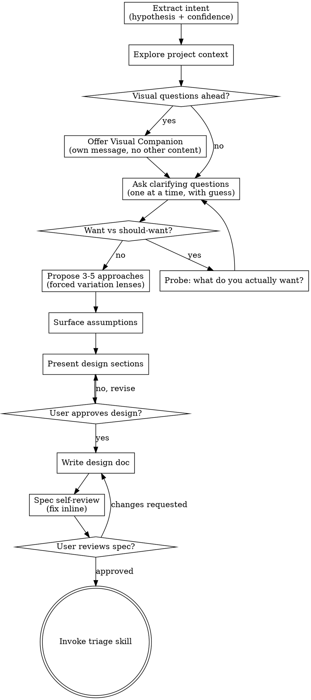

# Brainstorming Ideas Into Designs

Help turn ideas into fully formed designs and specs through natural collaborative dialogue.

Start by extracting what the user *actually* wants (not what they think they should want), then ask questions one at a time to refine the idea. Once you understand what you're building, present the design and get user approval.

<HARD-GATE>
Do NOT invoke any implementation skill, write any code, scaffold any project, or take any implementation action until you have presented a design and the user has approved it. This applies to EVERY project regardless of perceived simplicity.
</HARD-GATE>

## Anti-Pattern: "This Is Too Simple To Need A Design"

Every project goes through this process. A todo list, a single-function utility, a config change — all of them. "Simple" projects are where unexamined assumptions cause the most wasted work. The design can be short (a few sentences for truly simple projects), but you MUST present it and get approval.

## Checklist

You MUST create a task for each of these items and complete them in order:

1. **Extract intent** — write a one-sentence hypothesis about what the user wants, with a confidence number (0–100%). If below ~70%, append what's still unresolved.
2. **Explore project context** — check files, docs, recent commits
3. **Offer visual companion** (if topic will involve visual questions) — this is its own message, not combined with a clarifying question. See the Visual Companion section below.
4. **Ask clarifying questions** — one at a time, each with your guess/hypothesis attached. Watch for "want vs should-want" signals.
5. **Propose 3-5 approaches** — generated through forced variation lenses, with trade-offs and your recommendation
6. **Surface assumptions** — for each approach, list what you're betting is true but haven't validated
7. **Present design** — in sections scaled to their complexity (including commands, code style, boundaries, success criteria), get user approval after each section
8. **Write design doc (spec)** — save to `docs/superpowers/specs/YYYY-MM-DD-<topic>-design.md` and commit
9. **Spec self-review** — quick inline check for completeness, placeholders, contradictions, ambiguity, scope (see below)
10. **User reviews written spec** — ask user to review the spec file before proceeding
11. **Transition to triage** — invoke triage skill to define category, state, acceptance criteria, and agent-ready brief before planning

## Process Flow



**The terminal state is invoking triage.** Do NOT invoke writing-plans, frontend-design, mcp-builder, or any implementation skill. The ONLY skill you invoke after brainstorming is triage.

## The Process

### Step 1: Extract Intent

Before asking anything, write down your current best read of what the user wants in one sentence, plus an honest confidence number:

```
HYPOTHESIS: You want a way to answer "how are we doing?" in standup, and "dashboard" was the convention that came to mind.
CONFIDENCE: ~30% — missing: who it's for, what "metrics" means in context, and what success looks like
```

The number forces honesty. If you wrote down a high number but can't predict the user's reactions to the next three questions you'd ask, the number is wrong.

When confidence is below ~70%, append a brief reason — what's still unresolved or missing. This tells the user exactly what the interview needs to surface.

**The 95% Confidence Stop:** You're done extracting intent when you can answer yes to: *"Can I predict the user's reaction to the next three questions I would ask?"* If yes, move on. If no, keep asking.

**When NOT to extract intent:** The ask is unambiguous and self-contained ("rename this variable", "fix this typo"). Use judgment — skip this step only when you genuinely have ≥95% confidence from the start.

### Step 2: Explore Project Context

- Check out the current project state (files, docs, recent commits)
- Before asking detailed questions, assess scope: if the request describes multiple independent subsystems (e.g., "build a platform with chat, file storage, billing, and analytics"), flag this immediately. Don't spend questions refining details of a project that needs to be decomposed first.
- If the project is too large for a single spec, help the user decompose into sub-projects: what are the independent pieces, how do they relate, what order should they be built? Then brainstorm the first sub-project through the normal design flow. Each sub-project gets its own spec → plan → implementation cycle.
- If the request is for a user-facing product, identify the primary entrypoint and each required functional surface early: login, dashboard, admin portal, board, settings, etc. Do not let "general product polish" blur which routes must actually work.
- If marketing, preview, or informational routes are not explicitly requested, assume they are out of scope until the user asks for them.

### Step 3: Ask Clarifying Questions

Ask one question at a time. Each question MUST include your hypothesis/guess for the answer:

```
Q:     Who is this for — you alone, the engineering team, or leadership?
GUESS: Engineering team in standup, because "we" usually scopes that way and standups are where this question gets asked.
```

**Why attach a guess:**
- The user reacts faster to a wrong guess than they generate an answer from scratch
- It commits you to a hypothesis you can be visibly wrong about, which keeps you honest
- It surfaces *your* assumptions, which is what the interview is meant to expose

**Watch for "Want vs Should-Want" signals:**

The most dangerous answers are where the user says what a thoughtful answer *sounds like* rather than what they actually want. Watch for:
- Answers that pattern-match best-practice talk ("I want it to be scalable", "clean architecture") without specifics
- Answers that defer to convention ("the way most apps do it", "the standard approach")
- Phrases like "I should probably…", "I think I'm supposed to…", "good engineering practice says…"
- Buzzwords as goals — when "modern", "scalable", "robust" are the answer instead of a specific outcome

When you hear these, ask:

> *"If you didn't have to justify this to anyone, what would you actually want?"*

That single question often does more work than the previous five.

**Codebase-grounding:** If a question can be answered by exploring the codebase, explore the codebase instead of asking.

### Step 4: Propose 3-5 Approaches (Forced Variation Lenses)

Generate alternatives through specific lenses, not just "2-3 approaches." Use at least 3 of these lenses:

- **Inversion:** "What if we did the opposite?"
- **Constraint removal:** "What if budget/time/tech weren't factors?"
- **Audience shift:** "What if this were for [different user]?"
- **Simplification:** "What's the version that's 10x simpler?"
- **Combination:** "What if we merged this with [adjacent idea]?"
- **10x version:** "What would this look like at massive scale?"

Present options conversationally with your recommendation and reasoning. Lead with your recommended option and explain why. For each approach, state the trade-off explicitly.

### Step 5: Surface Assumptions

For each approach (or at minimum, for the recommended approach), explicitly list:

- **What you're betting is true** but haven't validated
- **What could kill this approach**
- **What you're choosing to ignore** (and why that's okay for now)

This is where most designs fail. Don't skip it.

### Step 6: Present the Design

Once you believe you understand what you're building, present the design. Scale each section to its complexity: a few sentences if straightforward, up to 200-300 words if nuanced. Ask after each section whether it looks right so far.

**The design MUST cover these sections:**

1. **Objective** — What are we building and why? Who is the user? What does success look like?
2. **Entrypoints And Surfaces** — Which route/page is the primary entrypoint, which surfaces must be functional in release 1, and whether any marketing/preview routes exist at all.
3. **Architecture** — Components, data flow, error handling
4. **Commands** — Full executable commands: build, test, lint, dev. Don't just name tools — give the actual commands.
5. **Project Structure** — Where source code lives, where tests go, where docs belong.
6. **Code Style** — One real code snippet showing conventions beats three paragraphs describing them. Include naming conventions.
7. **Testing Strategy** — What framework, where tests live, coverage expectations.
8. **Boundaries** — Three-tier system:
   - **Always do:** Run tests before commits, follow naming conventions, validate inputs
   - **Ask first:** Database schema changes, adding dependencies, changing CI config
   - **Never do:** Commit secrets, edit vendor directories, remove failing tests without approval
9. **Success Criteria** — Specific, testable conditions. Translate vague requirements into concrete targets. "Make it faster" → "Dashboard LCP < 2.5s on 4G, initial load < 500ms, CLS < 0.1"
10. **Out of Scope** — What we're explicitly NOT building. Non-negotiable. Half of misalignment is silent disagreement about what is *not* being built.

**Release slice rule:** If the requested product is too large for a single release, the design must name the exact release-1 slice in concrete behavioral terms. "Production-like foundation" is not enough. Say what works on which route, for which user, with which real interactions.

**Design for isolation and clarity:**

- Break the system into smaller units that each have one clear purpose, communicate through well-defined interfaces, and can be understood and tested independently
- For each unit, you should be able to answer: what does it do, how do you use it, and what does it depend on?
- Can someone understand what a unit does without reading its internals? Can you change the internals without breaking consumers? If not, the boundaries need work.
- Smaller, well-bounded units are also easier for you to work with - you reason better about code you can hold in context at once, and your edits are more reliable when files are focused. When a file grows large, that's often a signal that it's doing too much.

**Working in existing codebases:**

- Explore the current structure before proposing changes. Follow existing patterns.
- Where existing code has problems that affect the work (e.g., a file that's grown too large, unclear boundaries, tangled responsibilities), include targeted improvements as part of the design - the way a good developer improves code they're working in.
- Don't propose unrelated refactoring. Stay focused on what serves the current goal.

### Step 7: Confirm — Explicit Yes, Not "Whatever You Think"

The gate is an explicit "yes." The following are **not** yes:

- "Whatever you think is best." → The user is delegating. Re-ask with two concrete options framed as a choice.
- "Sounds good." → Ambiguous. Ask: "Anything you'd refine?" Silence isn't confirmation.
- "Sure, let's go." → Often a polite exit, not an endorsement. Same follow-up.

If they correct you, fold the correction in and re-present. Loop until you get an explicit yes.

## After the Design

**Documentation:**

Write the validated design (spec) to `docs/superpowers/specs/YYYY-MM-DD-<topic>-design.md` using this template:

```markdown
# Spec: [Project/Feature Name]

## Objective
[What we're building and why. User stories or acceptance criteria.]

## Architecture
[Components, data flow, error handling]

## Commands
[Build, test, lint, dev — full commands]

## Project Structure
[Directory layout with descriptions]

## Code Style
[Example snippet + key conventions]

## Testing Strategy
[Framework, test locations, coverage requirements, test levels]

## Boundaries
- Always: [...]
- Ask first: [...]
- Never: [...]

## Success Criteria
[Specific, testable conditions — not vague goals]

## Out of Scope
[What we're explicitly not building, and why]

## Entrypoints And Surfaces
- `/route` — purpose, user, and whether it is fully functional in this release
- `/route` — purpose, user, and whether it is fully functional in this release

## Key Assumptions
- [ ] [Assumption 1 — how to test it]
- [ ] [Assumption 2 — how to test it]

## Open Questions
[Anything unresolved that needs human input]
```

- User preferences for spec location override this default
- Use elements-of-style:writing-clearly-and-concisely skill if available
- Commit the design document to git

**Spec Self-Review:**
After writing the spec document, look at it with fresh eyes:

1. **Placeholder scan:** Any "TBD", "TODO", incomplete sections, or vague requirements? Fix them.
2. **Internal consistency:** Do any sections contradict each other? Does the architecture match the feature descriptions?
3. **Scope check:** Is this focused enough for a single implementation plan, or does it need decomposition?
4. **Ambiguity check:** Could any requirement be interpreted two different ways? If so, pick one and make it explicit.
5. **Completeness check:** Does the spec cover all required sections, including entrypoints/surfaces? If any are missing, add them — even if just a one-liner for simple projects.
6. **Assumption check:** Are the key assumptions listed with validation strategies? If not, add them.
7. **Success criteria test:** Could a developer read the success criteria and know exactly when the work is done? If not, make them more specific.
8. **Surface integrity check:** If the user asked for login, admin, dashboard, board, or other explicit product surfaces, does the spec say which routes exist and what they can actually do in release 1? If not, fix it.

Fix any issues inline. No need to re-review — just fix and move on.

**User Review Gate:**
After the spec review loop passes, ask the user to review the written spec before proceeding:

> "Spec written and committed to `<path>`. Please review it and let me know if you want to make any changes before we start writing out the implementation plan."

Wait for the user's response. If they request changes, make them and re-run the spec review loop. Only proceed once the user gives an explicit yes.

**Triage:**

- Once the user reviews and approves the spec, transition to triage.
- Invoke the triage skill to define the category, state, acceptance criteria, and agent-ready brief.
- Do NOT invoke writing-plans or other implementation/planning skills yet. Triage is the next step.

## Key Principles

- **One question at a time** - Don't overwhelm with multiple questions
- **Attach your guess** - Commit to a hypothesis on each question; the user reacts faster to a wrong guess than generating from scratch
- **Multiple choice preferred** - Easier to answer than open-ended when possible
- **YAGNI ruthlessly** - Remove unnecessary features from all designs
- **Explore alternatives through lenses** - Don't just propose similar variants; force divergent thinking through inversion, simplification, audience shift
- **Surface assumptions** - Untested assumptions are the #1 killer of good ideas. List them explicitly.
- **Incremental validation** - Present design, get approval before moving on
- **Be flexible** - Go back and clarify when something doesn't make sense
- **Explicit yes only** - "Whatever you think" and "sounds good" are not confirmation

## Common Rationalizations

| Rationalization | Reality |
|---|---|
| "The ask is clear enough" | If you can't write the user's desired outcome in one sentence right now, the ask isn't clear. Run the intent extraction step before deciding. |
| "This is too simple to need a design" | Simple tasks don't need *long* specs, but they still need acceptance criteria. A two-line spec is fine. |
| "Asking too many questions wastes their time" | Time wasted by 4-6 targeted questions is small. Time wasted by building the wrong thing is enormous, and the user bears that cost. |
| "I'll figure it out as I build" | Switching costs after code exists are 10x what they are now. Discovery during implementation is rework. |
| "They said 'whatever you think,' so I should just decide" | "Whatever you think" is delegation, not decision. Re-ask with two concrete options as a choice. |
| "I'll add commands/style/boundaries later" | Later never comes. The spec is the contract; missing sections mean the agent will guess during implementation. |
| "We've talked enough, I get it" | Test it: can you predict their reaction to the next three questions? If not, you don't get it yet. |
| "The user said yes, we're done" | If the yes followed a vague restate or an open-ended "sounds good," the yes is hollow. Restate concretely and re-confirm. |
| "Generating variations through lenses is overkill" | The first idea is rarely the best. Lenses take 2 extra minutes and often surface a 10x simpler approach. |
| "I don't need to surface assumptions" | Untested assumptions are the #1 killer of good ideas. Listing them costs nothing; ignoring them costs everything. |

## Red Flags

- Three or more questions in a single message: that's batching, not interviewing
- A question without your hypothesis attached: that's surveying, not committing
- Accepting "whatever you think is best" as a terminal answer
- Producing code, a plan, or a task list before the user has explicitly confirmed the design
- Questions framed as "what would be best practice?" instead of "what do you actually want?"
- The user gives a sophistication-signaling answer ("scalable", "clean", "modern") and you accept it without probing
- Three or more rounds of questions without your confidence visibly rising: you're asking the wrong questions, step back and reframe
- A confidence number below ~70% with no reason attached: the user can't help close the gap if they don't know what's missing
- Skipping the "Out of Scope" section in the spec: silent disagreement about non-goals is half of misalignment
- No explicit route/entrypoint mapping for a user-facing app: the agent will invent landing pages or preview routes
- Saying "production-like" or "modern" without stating which interactions are actually implemented
- Proposing approaches that are all variations on the same theme: you're converging too early
- Writing a spec without Commands, Code Style, Boundaries, Success Criteria, or Entrypoints And Surfaces

## Visual Companion

A browser-based companion for showing mockups, diagrams, and visual options during brainstorming. Available as a tool — not a mode. Accepting the companion means it's available for questions that benefit from visual treatment; it does NOT mean every question goes through the browser.

**Offering the companion:** When you anticipate that upcoming questions will involve visual content (mockups, layouts, diagrams), offer it once for consent:
> "Some of what we're working on might be easier to explain if I can show it to you in a web browser. I can put together mockups, diagrams, comparisons, and other visuals as we go. This feature is still new and can be token-intensive. Want to try it? (Requires opening a local URL)"

**This offer MUST be its own message.** Do not combine it with clarifying questions, context summaries, or any other content. The message should contain ONLY the offer above and nothing else. Wait for the user's response before continuing. If they decline, proceed with text-only brainstorming.

**Per-question decision:** Even after the user accepts, decide FOR EACH QUESTION whether to use the browser or the terminal. The test: **would the user understand this better by seeing it than reading it?**

- **Use the browser** for content that IS visual — mockups, wireframes, layout comparisons, architecture diagrams, side-by-side visual designs
- **Use the terminal** for content that is text — requirements questions, conceptual choices, tradeoff lists, A/B/C/D text options, scope decisions

A question about a UI topic is not automatically a visual question. "What does personality mean in this context?" is a conceptual question — use the terminal. "Which wizard layout works better?" is a visual question — use the browser.

If they agree to the companion, read the detailed guide before proceeding:
`skills/brainstorming/visual-companion.md`

## Verification

After completing brainstorming:

- [ ] An explicit hypothesis with a confidence number was stated at the start
- [ ] Every confidence number below ~70% was accompanied by a one-line reason
- [ ] Questions were asked one at a time, each with the agent's guess attached
- [ ] At least one "what would you actually want if you didn't have to justify it?" probe ran when the user gave a sophistication-signaling answer
- [ ] 3-5 approaches were generated through forced variation lenses (not just similar variants)
- [ ] Key assumptions were surfaced with validation strategies for the recommended approach
- [ ] The spec covers all required sections, including Entrypoints And Surfaces
- [ ] Success criteria are specific and testable (not vague goals)
- [ ] A concrete restate was written back to the user and confirmed with an explicit yes
- [ ] The spec self-review checked for placeholders, consistency, scope, ambiguity, and completeness
- [ ] The user reviewed the written spec before any handoff to triage
- [ ] The only skill invoked after brainstorming is triage (not writing-plans or any implementation skill)
